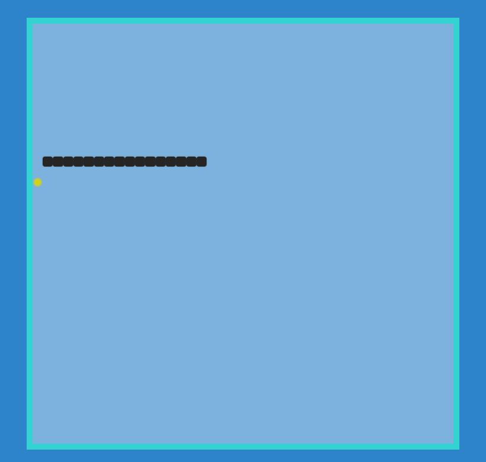

  
   
   

  <h2 align="center">Snake Game - A simple game project</h2>

  Calculater is a fully responsive static priject,  Responsive for all devices, build using HTML, CSS, and JavaScript.

  <a href="https://itsaqibzafar.github.io/Snake-Game/"><strong>➥ Live Demo</strong></a>

 

### Demo Screeshots

### Prerequisites

Before you begin, ensure you have met the following requirements:

* [Git](https://git-scm.com/downloads "Download Git") must be installed on your operating system.

### Contact

If you want to contact with me you can reach me at +1469 638 3136.

### License

[MIT](https://choosealicense.com/licenses/mit/)
